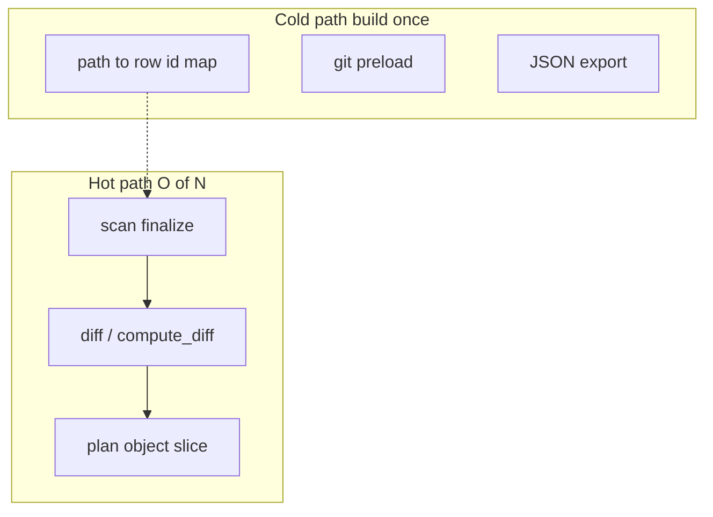
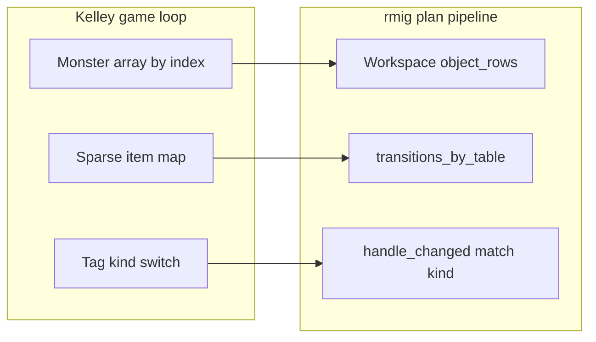
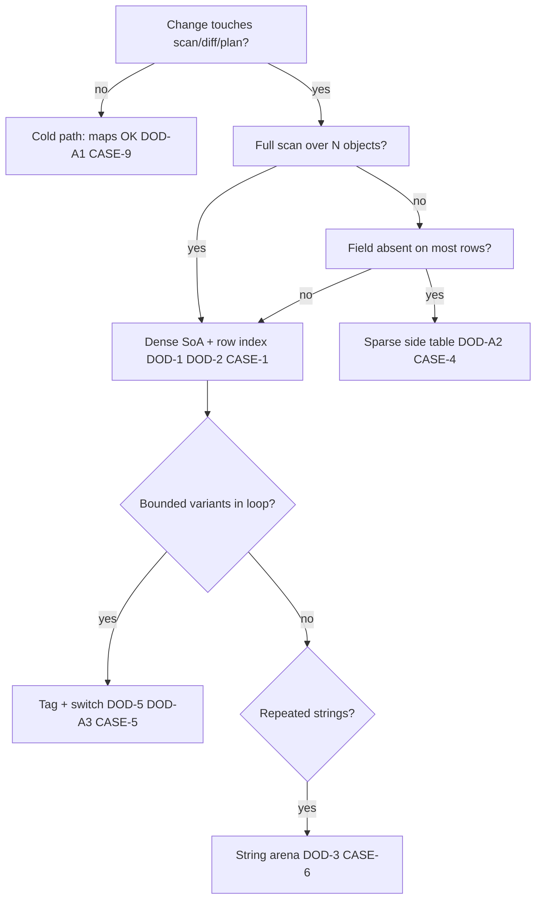

# Data-oriented layout policy

Lifecycle: `Current`.

## Purpose

Define non-negotiable **memory layout rules** for in-process hot paths: scan → diff → plan output. The goal is cache locality and allocation throughput on bulk loops, not domain encapsulation or polymorphic object graphs.

This document is the **canonical policy**. Measurement procedures live in [`perf-footprint-audit.md`](perf-footprint-audit.md).

## Scope

| Area | Repository paths |
|------|------------------|
| Rust scan / workspace | [`crates/core/src/domain/`](../crates/core/src/domain/), [`crates/core/src/scan/`](../crates/core/src/scan/) |
| Rust diff / plan | [`crates/core/src/plan/`](../crates/core/src/plan/), [`crates/core/src/export/`](../crates/core/src/export/) |
| Verification harness | [`perf-footprint-audit.md`](perf-footprint-audit.md), [`ops/perf/`](../ops/perf/) |

**Out of scope:** SQL Server I/O, network latency, CLI wiring, prod gate semantics, automated CI perf gates.

## System context

The plan pipeline touches **N objects** per run. Hot code runs **O(N)** over the full SQL tree: checksum preload, diff decisions, and plan row materialization. Layout choices that scatter data (pointer graphs, map iteration, virtual dispatch) dominate cache misses and heap churn at large N.

Rust scan uses dense object indices via [`Workspace::object_rows`](../crates/core/src/domain/workspace/mod.rs) + [`WorkspaceCold::key_index`](../crates/core/src/domain/workspace/cold.rs) and a Kelley-style string arena ([`StringArena`](../crates/core/src/domain/arena.rs), **CASE-6**). Hot [`Workspace`](../crates/core/src/domain/workspace/mod.rs) holds CASE-1 columns; cold maps/scripts/arena live in [`WorkspaceCold`](../crates/core/src/domain/workspace/cold.rs) behind `Box` (**COLD** / **SLAB**). Plan DB maps: [`ChecksumMap`](../crates/core/src/db/checksum_map.rs) uses `u64` byte fingerprints (lookup via `key_off` after finalize); `CatalogState.objects` uses [`ObjectKey`](../crates/core/src/domain/key.rs) - no duplicate normalized `String` keys vs layout. `SchemaEntry` and `CatalogObject` use `SharedStr` arena slices after scan finalize / SQL catalog load (`intern_catalog_state`).



## Interfaces and boundaries

### Hot path (policy applies)

Code that runs **once per layout row** on every plan/diff for the full tree:

- Scan finalize and checksum preload
- `plan::compute_diff`
- Building `[]PlannedObject` / `MigrationPlan.objects`

### Cold path (maps and side tables allowed)

- Path → normalized key / row id maps at scan end
- Git metadata preload
- JSON export, audit flush, configuration load

### Ownership

| Concern | Owner doc |
|---------|-----------|
| Layout policy (this doc) | `docs/data-oriented-layout-policy.md` |
| Footprint measurement | `docs/perf-footprint-audit.md` |
| Scan / workspace module behavior | `docs/specs/rust/module-domain.md` |

## Assumptions and constraints

### Core principles

1. **Memory hierarchy first:** The CPU is fast; L1/L2/L3 cache and RAM are the bottleneck. Hot-loop accesses should stay within cache lines where possible.
2. **Find the bulk type:** Identify the struct that appears most often during a plan; shrink and densify that type before adding abstractions.
3. **Measure before refactor:** Use struct baselines and allocation profiles (`make bench-footprint`, `make bench-footprint-alloc`). Do not change layout on intuition alone.
4. **Layout follows access pattern:** Full scans use arrays and struct-of-arrays (SoA). Side tables are allowed only when a field is provably sparse on real fixtures.

**Reference:** [Andrew Kelley - *Practical Data Oriented Design*](https://www.youtube.com/watch?v=IroPQ150F6c) (encoding vs OOP/polymorphism ~30:00; hash maps for sparse fields only).

### Required patterns (MUST on hot paths)

| ID | Rule | Rationale |
|----|------|-----------|
| **DOD-1** | **Struct-of-arrays (SoA)** for homogeneous collections; stable **`uint32` row IDs** | Eliminate array-of-struct padding; indices over pointers on 64-bit |
| **DOD-2** | **Dense iteration** via row index slices or sorted `[]uint32` - not map iteration in diff/plan | Full-scan access; maps belong on cold build paths |
| **DOD-3** | **String arena / intern table** for repeated schema, kind, and path bytes at scan finalize | One copy per distinct string |
| **DOD-4** | **Contiguous plan output** - pre-sized slice (or column arrays) from `object_count` | Dominant allocation ~240 B × N per planned row; minimize allocs/op |
| **DOD-5** | **Tag + `switch` / `match` on `kind`** - static dispatch only in the per-object loop | Prefer tags over vtables; no trait objects or interface calls in the hot loop |
| **DOD-6** | **Separate hot metadata from cold blobs** (checksums, git, paths on heap or side store; hot row = codes + indices) | Reduce pointer chasing per object touch |

**Reference:** dense `object_rows` + `ObjectRow` (CASE-1) in [`workspace/mod.rs`](../crates/core/src/domain/workspace/mod.rs).

### Allowed patterns (MAY, with conditions)

| ID | Rule | Condition |
|----|------|-----------|
| **DOD-A1** | `HashMap` / `map` for **path → row id** or **normalized_key → row id** | Build phase only (scan finalize / `RebuildPathIndexes`); not iterated in diff over all keys |
| **DOD-A2** | **Sparse side table** (`HashMap<u32, T>` / `map[uint32]T`) for rare fields | Documented sparsity (e.g. fewer than 10–20% of rows non-default) on smoke or prod-like fixture; lookup by id, not full map walk |
| **DOD-A3** | **Tag encoding** merging variant + flags into a small enum | Variant count is bounded; tag reflects measured distribution (Kelley encoding - not open-ended string keys) |
| **DOD-A4** | **Out-of-band booleans** (presence sets, separate alive/skip lists) | Replaces per-row `bool` when most rows share the same value |

### Forbidden patterns (MUST NOT on hot paths)

| ID | Rule | Why |
|----|------|-----|
| **DOD-X1** | Deep **OOP object graphs** (nested handles, lazy callbacks) touched every diff iteration | Pointer chasing; poor cache density |
| **DOD-X2** | **`HashMap<String, _>` as primary layout** for full-tree diff/plan | Random memory access each plan; see dhat ~7 MB/iter on HashMap-primary layouts |
| **DOD-X3** | **Trait objects / interface dispatch / virtual calls** in the per-object diff loop | Blocks inlining; unpredictable branches |
| **DOD-X4** | **Polymorphic class hierarchies** where a **`kind` byte + switch** covers all call sites | OOP/polymorphism loses to tag encoding on memory and cache |
| **DOD-X5** | **Dynamic-key encoding** (`map[string]any`, open-ended string tags) **without sparsity evidence** | Abstraction cost without measured win |
| **DOD-X6** | New **encapsulation layers** on the hot path solely for API cleanliness | Converge toward DOD, not more wrappers |

Detailed case-by-case mapping (Kelley examples → rmig situations): § [Layout decision guide](#layout-decision-guide) (**CASE-1**–**CASE-9**).

## Layout decision guide

Use this section when choosing a layout for a change. Rules **DOD-*** state *what* is allowed; **CASE-*** ties each rule to a *concrete access pattern* in rmig, with an Andrew Kelley analogue from [*Practical Data Oriented Design*](https://www.youtube.com/watch?v=IroPQ150F6c).



### How to choose a layout

Ask in order:

1. **Hot or cold?** (see § Interfaces) - cold paths may use maps and owned strings freely (**CASE-9**).
2. **Full scan over N rows or point lookup?** - full scan → dense SoA + row index (**CASE-1**); build-once lookup → map at finalize only (**CASE-2**).
3. **Is the field dense or sparse on real fixtures?** - sparse (<10–20% rows non-default) → side table keyed by row id (**CASE-4**); dense → column in SoA.
4. **What varies per row in the loop?** - bounded kind → tag + `switch` (**CASE-5**); repeated strings → arena (**CASE-6**); one output blob per run → pre-sized slice (**CASE-7**); cold blob lookup → side store (**CASE-8**).



### Case catalog

| Case ID | Situation (access pattern) | Kelley reference | rmig example (today / target) | Rules | Do / Don't |
|---------|---------------------------|------------------|-------------------------------|-------|------------|
| **CASE-1** | Dense **full-tree diff** - O(N), same metadata fields read for every layout object | *Monster* array: four pointer fields replaced by `u32` indices into one dense array; iterate by index, not pointer graph | **Done:** hot [`object_rows`](../crates/core/src/domain/workspace/mod.rs) + [`object_entries`](../crates/core/src/domain/workspace/objects.rs) + [`object_keys`](../crates/core/src/domain/workspace/mod.rs) + index loop in [`diff.rs`](../crates/core/src/plan/diff.rs); scan ingest via `push_object` → `finalize_object_layout` | **DOD-1**, **DOD-2** | **Do:** stable row id, `[]ObjectRow`, index `0..N-1`. **Don't:** `HashMap` as primary diff layout or map iteration over all keys |
| **CASE-2** | **Path/key lookup** - build index once, then random lookup by normalized key (delta, inspect) | Build lookup table once; hot loop resolves keys to indices, not repeated string walks | **`key_index`** at scan finalize in [`cold.rs`](../crates/core/src/domain/workspace/cold.rs); inspect scope map at build, not walked for all N in diff | **DOD-A1** | **Do:** map only in finalize / rebuild. **Don't:** iterate map keys inside the per-object diff loop |
| **CASE-3** | **Skip-heavy plans** - same outcome on ~98% of rows (`ActionSkipUnchanged`) | *Bool out-of-band:* separate alive/dead arrays instead of a `bool` on every struct when almost all rows share one value | **`PlanScenario`** `u8` enum - [`scenario.rs`](../crates/core/src/plan/scenario.rs): `resolve` → tag → `apply` → `Action` | **DOD-A4**, **DOD-A3** | **Do:** encode skip/create/reprocess (and changed sub-scenarios) as small enum tag or lookup table. **Don't:** store redundant `exists` + branch-heavy flags on every row when a partition or tag suffices |
| **CASE-4** | **Sparse per-table data** - transition scripts exist for a small subset of tables, not all N objects | *Strategy 4 (sparse hash):* hash map for monster *items* because ~90% of monsters carry none - map is cheaper than a column on every row | [`transitions_by_table`](../crates/core/src/domain/workspace.rs) - lookup in `PlanScenario::TableReprocess` path only | **DOD-A2** | **Do:** side table + lookup by row id; document sparsity on smoke/prod-like fixture. **Don't:** full map iteration in diff or dynamic string keys without evidence (**DOD-X5**) |
| **CASE-5** | **Bounded kind variants** - tables vs triggers vs default; fixed set of behaviors | ~30:07 *encoding vs polymorphism:* Human/Bee as tagged union beats OOP hierarchy and beats naive fat structs on cache and memory | `kindCode` in diff loop; changed sub-scenarios folded into **`PlanScenario`** | **DOD-5**, **DOD-A3** | **Do:** `kindCode` byte + `switch`/`match` in engine hot loop. **Don't:** trait objects, interfaces, string kind compares, or virtual calls in the per-object loop (**DOD-X3**, **DOD-X4**) |
| **CASE-6** | **Repeated strings** - same schema, kind, and path bytes on many rows | String interning: one blob + offsets (arena) instead of duplicating bytes per row | **Rust (done):** [`StringArena`](../crates/core/src/domain/arena.rs) single buffer at scan finalize; `SharedStr` arena slices. Bench fixtures use Arc-dedup [`StringInterner`](../crates/core/src/domain/arena.rs) | **DOD-3** | **Do:** intern at scan end; hot row holds slice into arena. **Don't:** clone `String` per row inside diff/plan |
| **CASE-7** | **Plan output** - one contiguous allocation domain per plan run | Contiguous output arrays - one big alloc for the result stream, not many small heap objects | Pre-sized plan rows from `object_count`; ~240 B × N (see [`perf-footprint-audit.md`](perf-footprint-audit.md)) | **DOD-4** | **Do:** pre-sized slice or column arrays. **Don't:** append without capacity or fat AoS graphs per planned row |
| **CASE-8** | **Cold blob lookup** - checksum map, catalog parent resolution; not touched for every row uniformly | Side data outside the hot struct - hot row holds indices; heavy data lives in separate stores | Trigger path in [`handle_trigger`](../crates/core/src/plan/changed.rs): checksum `HashMap` + catalog lookup for parent closure - scoped random access, not full-tree map walk | **DOD-6** | **Do:** hot row = codes + indices; checksums/git on side. **Don't:** embed cold blobs in the row type iterated O(N) |
| **CASE-9** | **Export / git / JSON / config** - I/O-bound or one-off; not the O(N) game loop | Not Kelley's per-frame monster loop - different access pattern | [`crates/core/src/export/`](../crates/core/src/export/), git preload in [`crates/core/src/git/`](../crates/core/src/git/) | Cold path | **Do:** maps and owned strings where clarity wins. **Don't:** apply hot-path SoA rules here without moving work into diff |

**Rule coverage:** every **DOD-1**–**DOD-6** and **DOD-A1**–**DOD-A4** rule appears in at least one case above. Forbidden **DOD-X1**–**DOD-X6** are the anti-patterns called out in **CASE-1**, **CASE-4**, and **CASE-5** (pointer graphs, primary HashMap layout, virtual dispatch, polymorphism, unproven dynamic keys, encapsulation-only wrappers).

### Worked examples

#### CASE-1: Full-tree diff over N objects

| | |
|--|--|
| **Input** | Layout with 5000 objects; 12 checksum-changed; remainder unchanged |
| **Kelley analogue** | Monster struct with four pointers → store `u32` indices into one array; walk `0..monster_count-1` reading dense fields |
| **Wrong (historical Rust)** | Iterate `Workspace.objects: HashMap<ObjectKey, ObjectEntry>`; duplicate storage in HashMap + dense vec at finalize - dhat ~7 MB/iter on diff, ~25 MB scan setup (**DOD-X2**) |
| **Correct (today)** | Dense `[]objectRow` (6 B row + side `ObjectEntry` vec); scan appends to `object_entries`; diff loop uses row index; path resolved via **CASE-2** `key_index` only at lookup sites |
| **Repo paths** | [`workspace/`](../crates/core/src/domain/workspace/), [`scan/parse.rs`](../crates/core/src/scan/parse.rs), [`plan/diff.rs`](../crates/core/src/plan/diff.rs) |

#### CASE-4: Sparse table transitions

| | |
|--|--|
| **Input** | 5000 layout objects; ~40 tables; 8 tables have non-scaffold `_migrations` transition scripts |
| **Kelley analogue** | ~90% of monsters have no items - hash map from monster id → items, not `items: []` on every monster struct |
| **Wrong** | Store transition path lists on every object row or iterate all entries in `transitions_by_table` during full diff |
| **Correct** | `transitions_by_table: HashMap<ObjectKey, Vec<...>>` - lookup only when `kind == tables` and row is changed; sparsity ~8/40 tables documented (**DOD-A2**) |
| **Repo paths** | [`crates/core/src/domain/workspace.rs`](../crates/core/src/domain/workspace.rs), [`crates/core/src/plan/changed.rs`](../crates/core/src/plan/changed.rs) |

#### CASE-3: Scenario combinations - nested branches vs combined tag

| | |
|--|--|
| **Input** | 5000 objects; ~4900 unchanged; ~12 changed across kinds (tables, triggers, modules, default) |
| **Kelley analogue** | *DOD-A3* - merge variant + flags into one small tag; dispatch with `switch`, not scattered booleans and strings |
| **Today** | `PlanScenario` tag covers lifecycle + changed sub-cases; `resolve_plan_scenario` → `apply_scenario` → `Action` |
| **Repo paths** | [`crates/core/src/plan/scenario.rs`](../crates/core/src/plan/scenario.rs), [`crates/core/src/engine/run.rs`](../crates/core/src/engine/run.rs) |

##### ObjectDecision vs PlanScenario (Rust diff pipeline)

`PlanScenario` and `ObjectDecision` serve **different phases**. Do not merge them into one struct.

| Type | Phase | Lifetime | Kelley role |
|------|-------|----------|-------------|
| **`PlanScenario`** | decide (`resolve_plan_scenario` → `apply_scenario`) | stack in [`diff_decide.rs`](../crates/core/src/plan/diff_decide.rs) only | **CASE-3** combined tag (`u8`, `Copy`) |
| **`ObjectDecision`** | fill (`fill_planned_at`) | ephemeral stack per loop iteration | **CASE-7** fill contract - not O(N) bulk storage |

**Canonical `ObjectDecision` fields** ([`diff_object.rs`](../crates/core/src/plan/diff_object.rs)):

| Field | Purpose |
|-------|---------|
| `action: Action` | Wire outcome → `PlannedObject.planned_action` |
| `exists: bool` | → `PlannedObject.exists` |
| `with_git: bool` | **CASE-8** gate for optional git copy into plan row |

**Do not add to `ObjectDecision`:**

- `scenario: PlanScenario` - duplicate of decide tag; fill derives behavior from `Action` + side tables
- `Vec<SharedStr>` / owned strings - heap on stack each iteration (**DOD-X6** / **CASE-6** violation)
- New fields without a **CASE-*** id and dhat evidence in the same PR

Warmed skip-heavy re-run uses **action-stable** compare in [`diff_fill_skip.rs`](../crates/core/src/plan/diff_fill_skip.rs) (`planned_action`, `exists`, checksum, key) - not `PlanScenario` in the fill contract.

Transition paths: **CASE-4** - read from `transition_path_cache` at fill time, not carried in `ObjectDecision`.

#### CASE-5: Kind dispatch without polymorphism

| | |
|--|--|
| **Input** | Changed table → reprocess with transition paths; changed trigger with parent → parent checksum check; other kinds → default action |
| **Kelley analogue** | ~30:07 - compare OOP `Human`/`Bee` hierarchy vs tagged encoding; tag + branch wins for bounded variants |
| **Wrong** | `trait ObjectBehavior { fn on_changed(...) }` or dynamic dispatch inside the per-object loop (**DOD-X3**, **DOD-X4**) |
| **Wrong (also)** | String `match obj.kind` when `kindCode` already exists on scan row but is not passed into diff |
| **Correct** | `PlanScenario` encodes kind-specific changed paths; `kindCode` read from dense row |
| **Repo paths** | [`crates/core/src/domain/workspace/mod.rs`](../crates/core/src/domain/workspace/mod.rs), [`crates/core/src/plan/scenario.rs`](../crates/core/src/plan/scenario.rs) |

### Quick reference (PR authors)

| If your change… | Use case | Rule IDs |
|-----------------|----------|----------|
| Iterates all layout objects in diff/plan | **CASE-1** | DOD-1, DOD-2 |
| Adds path → row lookup at scan end | **CASE-2** | DOD-A1 |
| Handles mostly-unchanged trees | **CASE-3** | DOD-A3, DOD-A4 |
| Adds data present on <20% of rows | **CASE-4** | DOD-A2 |
| Branches on object kind (table, trigger, …) | **CASE-5** | DOD-5, DOD-A3 |
| Dedupes schema/kind/path strings | **CASE-6** | DOD-3 |
| Builds migration plan output slice | **CASE-7** | DOD-4 |
| Reads checksums/catalog for one object | **CASE-8** | DOD-6 |
| Touches export, git preload, JSON only | **CASE-9** | (cold path) |

## Nominal flow

1. Author identifies whether a change touches **hot** or **cold** path (see § Interfaces) and names the matching **CASE-*** id(s) (see § Layout decision guide).
2. Hot-path layout must satisfy **DOD-1** through **DOD-6** or cite an allowed **DOD-A*** pattern with evidence.
3. Before merge, run footprint audit commands from [`perf-footprint-audit.md`](perf-footprint-audit.md) when layout changes materially.
4. Record before/after bench or dhat totals in the PR when touching [`crates/core/src/domain/`](../crates/core/src/domain/), [`crates/core/src/plan/`](../crates/core/src/plan/), [`crates/core/src/domain/`](../crates/core/src/domain/), or [`crates/core/src/plan/`](../crates/core/src/plan/).

## Off-nominal behavior and failure containment

- **Policy violation without measurement:** Treat as review blocker for hot-path PRs until footprint evidence shows no regression or intentional baseline update.
- **Sparse side table without sparsity note:** **DOD-A2** not satisfied; default to dense column or reject until fixture stats are documented.
- **New map iteration in diff:** **DOD-X2** / **DOD-2** violation unless scoped to cold path only.

## Verification and validation

| Check | Command / artifact |
|-------|-------------------|
| Struct baseline | `make bench-footprint` + `footprint_baseline_match` |
| Rust struct baseline | `cargo test -p migrator-core-dev --test footprint_baseline footprint_baseline_match` |
| CPU flamegraph | `make bench-footprint-profile` |
| Rust dhat | `make bench-footprint-alloc` |
| Full audit runbook | [`perf-footprint-audit.md`](perf-footprint-audit.md) § Nominal flow |

Policy compliance is validated by **footprint audit**, not static lint alone.

### PR review checklist

- [ ] Change classified as hot path (scan / diff / plan output) or cold path?
- [ ] Matching **CASE-*** id(s) named if layout changed (see § Layout decision guide)?
- [ ] Bulk type and access pattern stated in PR description?
- [ ] No new full-scan map iteration or trait/interface dispatch on hot path?
- [ ] If a side table was added: sparsity justified (**CASE-4**, **DOD-A2**)?
- [ ] Footprint or dhat artifact attached for layout-affecting PRs?

## Operations and recovery

Routine check before large layout PRs:

```bash
make bench-footprint && make bench-footprint
make bench-footprint-profile && make bench-footprint-alloc
make profile-summary
```

Update committed baselines only with maintainer intent: `make bench-footprint-update-baseline`, `make bench-footprint-update-baseline`.

## Open issues and non-goals

- **Non-goals:** CI hard-fail on perf thresholds; SQL wall-time SLO; enforcing policy via compiler plugin.

## References

- [`docs/dod.md`](dod.md) - layout invariants and baseline sizes
- [`docs/perf-footprint-audit.md`](perf-footprint-audit.md) - measurement runbook
- [`docs/specs/rust/module-domain.md`](specs/rust/module-domain.md) - workspace, arena
- [Andrew Kelley - *Practical Data Oriented Design*](https://www.youtube.com/watch?v=IroPQ150F6c)
- Mike Acton - *Data-Oriented Design and C++* (CppCon 2014)
