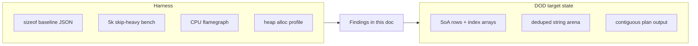

# Technical Document: Footprint, flamegraph, and allocation audit

Lifecycle: `Current`.

## Purpose

Define how operators and maintainers measure **in-process** memory and CPU behavior of the plan pipeline (scan → diff / plan output) for Go `rmig` and Rust `rmig`, capture baselines, and prioritize layout refactors.

Layout rules (SoA, hot vs cold path, forbidden patterns) are in [`data-oriented-layout-policy.md`](data-oriented-layout-policy.md). This document is the **measurement runbook** only.

This document answers: which structs dominate `sizeof`, where allocators spend bytes, and what to change next without mistaking SQL wall time for CPU/heap regressions.

## Scope

- Go footprint harness: [`internal/perf/`](../internal/perf/), [`ops/perf/footprint_bench.sh`](../ops/perf/footprint_bench.sh), baseline [`internal/app/testdata/perf/footprint_baseline.json`](../internal/app/testdata/perf/footprint_baseline.json)
- Rust footprint harness: [`rust/crates/core/src/perf/`](../rust/crates/core/src/perf/), [`ops/perf/rust_footprint_bench.sh`](../ops/perf/rust_footprint_bench.sh), baseline [`internal/app/testdata/perf/rust_footprint_baseline.json`](../internal/app/testdata/perf/rust_footprint_baseline.json)
- Benches: Go `BenchmarkDiffCompute_SkipHeavy_5000Objects`; Rust `plan_diff_skip_heavy_5000` ([`rust/crates/core/benches/plan_diff.rs`](../rust/crates/core/benches/plan_diff.rs))
- Profile artifacts under `ops/perf/artifacts/` (gitignored except committed JSON baselines)
- Summary script: [`ops/perf/profile_summary.sh`](../ops/perf/profile_summary.sh)

**Out of scope:** SQL Server tuning, `cli_wall_ms` SLO ([`docs/prod-gate.md`](prod-gate.md), `make rust-slo`), CI hard gates on perf.

## System context

Both stacks run a **synthetic 5k-object skip-heavy diff** (objects exist in catalog; checksums match → mostly `SkipUnchanged`). This isolates plan/diff CPU and heap from network I/O.

Go layout scan already uses DOD pieces ([`internal/fs/store.go`](../internal/fs/store.go) `ObjectStore` / `objectRow`, string arena). Rust still holds hot state in `HashMap`-backed [`Workspace`](../rust/crates/core/src/domain/workspace.rs) and fat per-object structs — higher pointer chasing and allocation churn than the Go scan index.



## Interfaces and boundaries

### Inputs

| Input | Source |
|-------|--------|
| Go struct sizes | `internal/perf.CollectStructSizes()` |
| Go bench metrics | `go test -benchmem` via `footprint_bench.sh bench` |
| Go profiles | `footprint_bench.sh profile` → `footprint_5k.{cpu,mem}.prof` |
| Rust struct sizes | `migrator_core::perf::collect_struct_sizes()` |
| Rust bench | `cargo bench --bench plan_diff` (`compute_diff_into`, warmed plan — same as dhat) |
| Rust CPU flamegraph | Criterion + `pprof` → `rust_plan_diff_5k_flamegraph.svg` |
| Rust heap | `cargo bench --bench plan_diff_dhat` → `rust_plan_diff_dhat.txt` |

### Outputs

| Artifact | Path |
|----------|------|
| Go bench log | `ops/perf/artifacts/footprint_bench.txt` |
| Go profile summary | `ops/perf/artifacts/profile_summary.txt` |
| Rust struct JSON | `ops/perf/artifacts/rust_struct_sizes.json` |
| Rust bench log | `ops/perf/artifacts/rust_footprint_bench.txt` |
| Rust dhat summary | `ops/perf/artifacts/rust_plan_diff_dhat.txt` |
| Rust CPU SVG | `ops/perf/artifacts/rust_plan_diff_5k_flamegraph.svg` |

## Assumptions and constraints

### Layout policy

Hot-path layout MUST follow [`data-oriented-layout-policy.md`](data-oriented-layout-policy.md) (rules **DOD-1**–**DOD-6**, allowed **DOD-A***, forbidden **DOD-X***). For situation-specific choices (Kelley → rmig), use § Layout decision guide (**CASE-1**–**CASE-9**) in that doc. Rust should converge toward Go phase-4 scan index (`ObjectStore`), not add encapsulation layers on the diff loop.

### Measurement constraints

- `sizeof` / `std::mem::size_of` reports **stack struct size**, not heap behind `String`, `Vec`, `HashMap`.
- Go mem profile for 5k bench includes **one-time** `makeBenchFS` / checksum preload in the profile run — interpret `alloc_space` top lines accordingly ([`profile_summary.sh`](../ops/perf/profile_summary.sh)).
- Rust `dhat` reports bytes for **20×** `compute_diff` per process; divide totals for per-iteration estimates.
- Full CLI CPU profiles (`cli_plan.cpu.prof`, `rust_rmig_plan_flamegraph.svg`) are **I/O bound** — not used for layout decisions.

## Nominal flow

### 1. Struct audit (static)

```bash
# Go
make bench-footprint
go test ./internal/perf/ -run TestStructSizeReport -v -count=1
go test ./internal/perf/ -run TestFootprintBaselineMatch -count=1

# Rust
make rust-bench-footprint
cargo test -p migrator-core --test rust_footprint_baseline footprint_baseline_match -q
```

### 2. CPU flamegraph (in-process 5k)

```bash
make bench-footprint-profile          # Go
make rust-bench-footprint-profile     # Rust → rust_plan_diff_5k_flamegraph.svg
make profile-summary                  # text top-20
```

### 3. Heap / allocations

```bash
go tool pprof -top -alloc_space ops/perf/artifacts/footprint_5k.mem.prof
make rust-bench-footprint-alloc       # dhat → rust_plan_diff_dhat.txt
```

### 4. Refresh baselines (maintainers only)

```bash
make bench-footprint-update-baseline
make rust-bench-footprint-update-baseline
```

## Verification and validation

| Check | Command |
|-------|---------|
| Go struct baseline | `go test ./internal/perf/ -run TestFootprintBaselineMatch` |
| Go bench regression (optional) | `RMIG_FOOTPRINT_BENCH=1 go test ./internal/perf/ -run TestFootprintBenchmarkRegression` |
| Rust struct baseline | `cargo test -p migrator-core --test rust_footprint_baseline footprint_baseline_match` |
| Rust LOC / arch | `scripts/check-rust-loc.sh`, `scripts/check-rust-arch.sh` |

**Exit criteria for an audit cycle:** baselines committed or reviewed; `profile_summary.txt` and dhat totals recorded in **Findings** below; DOD backlog items filed with concrete paths.

## Findings (snapshot 2026-05-20)

Environment: darwin/arm64, local `go test` / `cargo bench`. Re-run commands above after material layout changes.

### Struct sizes (`sizeof` / `size_of`, threshold ≥ 40 B)

| Rank | Go (`package.type`) | Bytes | Rust (`package.type`) | Bytes |
|------|---------------------|------:|-----------------------|------:|
| 1 | `types.MigrationPlan` | 496 | `domain.Workspace` | **416** |
| 2 | `fs.CachedFile` | 240 | `config.Config` | 336 |
| 3 | `types.PlannedObject` | 240 | `domain.ObjectEntry` | **184** |
| 4 | `fs.Layout` | 192 | `export.PlannedObject` | **144** |
| 5 | `fs.Object` | 176 | `domain.Script` | **128** |
| — | `fs.objectRow` (SoA) | 16 | `domain.ObjectRow` (SoA) | 6 |
| — | — | — | `domain.ObjectStore` (header) | 96 |

**Note:** Rust `Workspace` / `ObjectStore` `size_of` excludes heap for `HashMap` buckets, `Vec` rows, and `SharedStr` data. Scan ingest appends to **`object_entries`** via [`push_object`](../rust/crates/core/src/domain/workspace.rs); **`ingest_key_index`** (upsert only, cleared at finalize) is **CASE-2** staging, not primary layout storage.

### Go alloc / CPU (5k skip-heavy, committed baseline)

| Metric | `BenchmarkDiffCompute_SkipHeavy_5000Objects` |
|--------|---------------------------------------------|
| `ns/op` | ~938,266 |
| `allocs/op` | **3** |
| `B/op` | **1,057,520** (~240 B × 5000 plan objects + overhead) |

**`alloc_space` top:** `diff.(*Computer).Compute` (~63% of sampled bytes). Bench setup (`makeBenchFS`, checksum preload) also visible — use mem profile for regressions on **Compute** after warmup.

**CPU profile:** sample dominated by profiler/runtime noise in last run; use `-base` compares after refactors, or narrow with `pprof -focus=diff.Compute`.

### Rust alloc / CPU (5k skip-heavy, post footprint pass — Rust-only)

| Metric | Baseline (2026-05-20) | +ObjectStore/arena | +plan reuse | +empty_str/Option git | **+in-place plan / dense bench (**latest**)** |
|--------|------------------------|---------------------|-------------|-------------------------------------|-----------------------------------------------|
| dhat loop (warmed ×20) | **~7.0 MB/iter** | **~1.24 MB/iter** | **~296 KB/iter** | ~56 KB/iter (misleading) | **0 B/iter** (skip-heavy) |
| dhat total (warm + 20 iter + setup) | ~139 MB | ~43 MB | ~24.4 MB | ~16.3 MB | **~10.9 MB** (setup ~10.2 MB) |
| criterion `ns/op` (5k skip-heavy) | — | — | — | ~2.59 ms (`compute_diff`) | **~1.1 ms** (`compute_diff_into`, catalog cached) |
| `PlannedObject` `size_of` | 304 B | 248 B → 224 B | 224 B | 224 B | **144 B** |
| `Workspace` `size_of` | — | — | 344 B | 368 B → 416 B | **416 B** (`catalog_flags: u8`, no fp storage) |
| `Script` `size_of` | — | 224 B | 224 B → 216 B | 216 B → 192 B | **128 B** |

**dhat phases** (see [`dhat_alloc_tree.py`](../ops/perf/dhat_alloc_tree.py)): **setup** (fixture build) | **warm** (first `ensure_plan_objects` resize) | **loop** (warmed ×20 — headline **B/iter**). Default: `make rust-bench-footprint-alloc`. Variants: `make rust-bench-footprint-alloc ARGS=transitions`, `ARGS=scan`.

| Bench | Command | Purpose |
|-------|---------|---------|
| skip-heavy 5k | `alloc` (default) | skip-unchanged hot path |
| table+transitions 500 | `alloc transitions` | `paths_by_table` + `TableReprocess` |
| scan fixture 5k | `alloc scan` | real `scan_root` ingest |

**dhat call-tree (skip-heavy, latest):** loop **0 B/iter**; warm **~1.12 MB** one-time plan resize. Artifact: [`ops/perf/artifacts/rust_alloc_flame.txt`](../ops/perf/artifacts/rust_alloc_flame.txt).

**CPU flamegraph (skip-heavy, 2026-05-20, regen after bench align):** [`rust_plan_diff_5k_flamegraph.svg`](../ops/perf/artifacts/rust_plan_diff_5k_flamegraph.svg). Criterion bench uses **`compute_diff_into`** with a warmed `MigrationPlan` (matches dhat loop). Top rmig frames (~182 samples): `compute_diff_into` ~81%, `decide_object_at` ~37%, `apply_catalog` / `for_each_entry_mut` ~28%, `apply_checksums` ~13%, `fill_planned_at` ~3%. No `drop_in_place<MigrationPlan>` — prior SVG was stale (`push_planned`, `compute_diff` per iter).

**CPU flamegraph (skip-heavy, latest):** top rmig frames after catalog/checksum cache: `compute_diff_into` ~53%, `decide_object_at` ~31% — no `apply_catalog` / `for_each_entry_mut` on warmed loop (was ~28% / ~13%).

- **Catalog/checksum API keys:** `ChecksumMap` = `HashMap<ObjectKey, [u8;32]>`; `CatalogState.objects` keyed by `ObjectKey` (no duplicate normalized `String` keys vs layout)
- **`CatalogObject` row:** `schema` / `kind` / `name` / `parent` are `SharedStr`; wire path uses [`catalog_object`](../rust/crates/core/src/db/state.rs), layout path uses `catalog_object_parts` (clone arena slices — no second `share()`)

**Rust changes (2026-05-20 DOD closure):**
- **`SchemaEntry` → `SharedStr`** — arena slices at scan finalize (no `.to_string()` round-trip)
- **`intern_catalog_state`** — Kelley buffer after SQL catalog load / cache hit
- **Go↔Rust e2e:** `make go-rust-e2e-all` — full matrix on `.temp/sql` (see [`ops/perf/README.md`](../ops/perf/README.md)); subset `make go-rust-e2e` = `empty_db_plan` + `warm_db_plan`

**Rust changes (2026-05-20 follow-up):**
- **CASE-6:** [`StringArena`](../rust/crates/core/src/domain/arena.rs) — single backing buffer; `SharedStr` arena slices after scan intern
- **Git arena:** `intern_script_git_strings` after [`git_preload::preload`](../rust/crates/core/src/scan/git_preload.rs) in [`populate`](../rust/crates/core/src/scan/mod.rs) (Kelley buffer for git metadata)
- **Catalog/checksum cache:** `apply_catalog_if_needed` / `apply_checksums_if_needed` — once per layout (`catalog_flags` bitset; invalidated on `reset_layout` / `finalize_object_layout` / `adopt_dense_entries`)

**Rust changes (footprint cycle):**
- `fill_planned_at` — in-place plan refresh (`resize_with` + field update); no `clear`/`push` per object
- `adopt_dense_entries` — bench builds `Vec<ObjectEntry>` directly (no `HashMap` + rebuild)
- `Script.git_{hash,author,date}` — `SharedStr` (**CASE-8** tail)
- `object_entries: Vec<ObjectEntry>` — dense layout; index-only diff loop
- Bench fixture: `StringInterner` in one pass; `ObjectKey::from(interned)` (no `ObjectKey::new` lowercase churn)
- CPU bench [`plan_diff.rs`](../rust/crates/core/benches/plan_diff.rs): `compute_diff_into` + warmed plan (aligned with dhat; ~2× faster than per-iter `compute_diff`)

Go reference unchanged (~1.06 MB/op, 3 allocs/op) — **not modified in this cycle**.

### Go ↔ Rust layout mapping

| Go (DOD-oriented) | Rust (current) | Gap |
|-------------------|----------------|-----|
| `fs.ObjectStore` + `objectRow` (**CASE-1**) | `object_store` + `object_entries` + index diff loop; scan via `push_object` → `finalize_object_layout` | **Done** (2026-05-20) — matches Go `[]*Object` + finalize index |
| `layout.stringArena` (**CASE-6**) | `StringArena` at scan finalize; `SharedStr` arena slices on hot fields | **Done** — matches Go Kelley buffer |
| `types.PlannedObject` slice (**CASE-7**) | `MigrationPlan.objects: Vec<PlannedObject>` pre-sized | Rust row 248 B vs Go 240 B — close |
| `CachedFile` on heap (**CASE-8**) | `Script` git on `SharedStr`; `PlannedObject.git: Option<PlannedGit>` | Plan row still wider than Go; git copied into plan only when `with_git` |
| Scenario encoding (**CASE-3**, **CASE-5**) | `PlanScenario` tag → `resolve_plan_scenario` + `apply_scenario` | Go: diff uses `PlanScenario`; **`PlannedAction` stored as `string`** in plan JSON (apply switch uses string constants, not typed enum) |

## Optimization backlog (policy-aligned)

| Priority | Policy | Item | Status |
|----------|--------|------|--------|
| **P0** | **CASE-1** | Rust: `ObjectStore` SoA + index diff loop + dense scan ingest | **Done** (2026-05-20) — [`store.rs`](../rust/crates/core/src/domain/store.rs), [`diff.rs`](../rust/crates/core/src/plan/diff.rs), [`parse.rs`](../rust/crates/core/src/scan/parse.rs) |
| **P0** | **CASE-7** | Plan output: pre-sized contiguous slice; slim row | **Done** (in-place) — `ensure_plan_objects` + `fill_planned_at`; row **224 B** |
| **P1** | **CASE-3** | Combined `PlanScenario` tag → `Action` dispatch | **Done** (Rust) — [`scenario.rs`](../rust/crates/core/src/plan/scenario.rs) |
| **P1** | **CASE-5** | `kindCode` in diff hot loop | **Done** (Rust) — [`kind_code.rs`](../rust/crates/core/src/domain/kind_code.rs) |
| **P1** | **CASE-6** | Rust: string intern at scan finalize | **Done** — [`arena.rs`](../rust/crates/core/src/domain/arena.rs), `intern_workspace_strings` in [`walk.rs`](../rust/crates/core/src/scan/walk.rs) |
| **P1** | **CASE-1** | Drop redundant `object_order` | **Done** — diff uses `object_store` only |
| **P2** | **CASE-4** | Transition path map in diff | **Done** — `transition_path_cache` at scan finalize; `fill_planned_at` reads cache; loop **0 B/iter** (500 tables) |
| **P2** | **CASE-8** | Shrink `PlannedObject` / git as side data | **Closed (deferred)** — `Script.git_*: SharedStr`; plan git optional; side store not needed (audit **G**) |
| **Defer** | — | SQL inspect / catalog cache / `rmigd` session | — |

Violations remaining (Rust): none on hot path / layout scan+catalog. `CatalogState.schemas: HashSet<String>` retained (small set, lowercase keys).

**Go↔Rust e2e:** `make go-rust-e2e-all` — seven scenarios on `.temp/sql` (`empty_db_plan`, `prod_gate_cold`, `apply_smoke_result`, `warm_db_plan`, `skip_unchanged_plan`, `catalog_cache_plan`, `blocked_table_plan`); `make go-rust-e2e` runs plan subset only. See [`ops/perf/README.md`](../ops/perf/README.md).

## Audit decisions (2026-05-20)

Footprint audit cycle scope and resolved open questions. **Go code not modified** unless a separate parity task is opened.

| ID | Question | Decision | Rationale |
|----|----------|----------|-----------|
| **A** | Next cycle scope | **Rust-only footprint + harness/docs** | User constraint; Go reference unchanged |
| **B** | P0 priority | **Harness → setup heap → measure scan/transitions** | Hot diff path already ~0 B/iter warmed |
| **C** | Go `PlannedAction` string | **Doc fix only** | Apply already switches on typed string constants; JSON wire stays `string` |
| **D** | dhat metrics | **Split setup / warm / loop** in `dhat_alloc_tree.py` | Amortized 56 KB/iter was misleading |
| **E** | CASE-6 single buffer | **Done** — `StringArena` + `SharedStr` slice variant | One `Arc<[u8]>` per scan; bench still uses Arc-dedup `StringInterner` |
| **F** | CASE-1 scan HashMap | **Done** — `push_object` + `object_entries`; staging `ingest_key_index` cleared at finalize | Removes duplicate `HashMap<ObjectKey, ObjectEntry>`; scan setup −~3.4 MB (5k fixture) |
| **G** | CASE-8 git side store | **Keep `Script.git_*` + `Option<PlannedGit>`** | Row 224 B ≈ Go 240 B; separate side table low ROI until transition-heavy prod profile says otherwise |
| **I** | Transitions diff alloc | **`transition_path_cache` + cache fill in `fill_planned_at`** | Loop **0 B/iter** (500 tables); was ~148 KB before cache, ~32 KB after partial fix |
| **J** | Scan HashMap ingest | **Done** (same as **F**) | `alloc scan`: setup ~25 MB (scan ingest + 5k catalog rows; loop **0 B/iter** unchanged) |
| **H** | CI perf gate | **Maintainer-only** (non-goal) | Per policy; manual `make rust-bench-footprint-alloc` before layout PRs |

**Audit cycle status: CLOSED (2026-05-20).** Hot path + setup-key dedup complete. Remaining **defer:** SQL/rmigd session layout, CI gate, Go parity.

### Final dhat snapshot (darwin/arm64)

| Bench | Setup | Warm | Loop B/iter |
|-------|-------|------|-------------|
| skip-heavy 5k | ~10.2 MB | ~720 KB | **0 B** |
| table+transitions 500 | ~2.19 MB | ~144 KB | **0 B** |
| scan fixture 5k | ~25 MB | ~720 KB | **0 B** |

Commands: `make rust-bench-footprint-alloc`, `ARGS=transitions`, `ARGS=scan`.

## Off-nominal behavior

- **Missing baseline JSON:** run `make *-footprint-update-baseline` after reviewed struct layout change.
- **No `git` / no Docker:** footprint benches still run; CLI SQL profiles skipped.
- **`make rust-bench-footprint-profile` slow:** use `cargo bench --bench plan_diff -- --profile-time=1` manually.

## Operations and recovery

Routine audit before large layout PRs:

```bash
make bench-footprint && make rust-bench-footprint
make bench-footprint-profile && make rust-bench-footprint-alloc
make profile-summary
```

Compare Go mem: `go tool pprof -base ops/perf/artifacts/footprint_5k.mem.prof <new.prof>`. Compare Rust heap: re-run dhat and diff `rust_plan_diff_dhat.txt` totals.

## Open issues

- Rust criterion vs Go bench not byte-identical workloads (Rust `skip_heavy_workspace` vs Go full scan). Cross-stack compares are **directional** only.
- `dhat-heap.json` copied to `ops/perf/artifacts/rust_dhat_heap.json` after alloc bench; variant reports: `rust_alloc_flame_transitions.txt`, `rust_alloc_flame_scan.txt`.
- `integration_plan_sqlserver_suite` may fail `cli_wall_ms` SLO without `rmigd` harness — env issue, not footprint regression (see [`rust-port-plan.md`](rust-port-plan.md)).
- **Deferred (next cycle, if any):** `CatalogState.schemas` HashSet owned strings; SQL/rmigd defer backlog.

## References

- [`docs/data-oriented-layout-policy.md`](data-oriented-layout-policy.md) — canonical hot-path layout policy
- [`docs/solution.md`](solution.md) — § DOD layout footprint (phase 4)
- [`docs/specs/internals/module-fs.md`](specs/internals/module-fs.md) — `ObjectStore`, arena
- [`ops/perf/README.md`](../ops/perf/README.md) — script index
- [`docs/rust-port-plan.md`](rust-port-plan.md) — verification table
- [`rust/README.md`](../rust/README.md) — Rust commands
