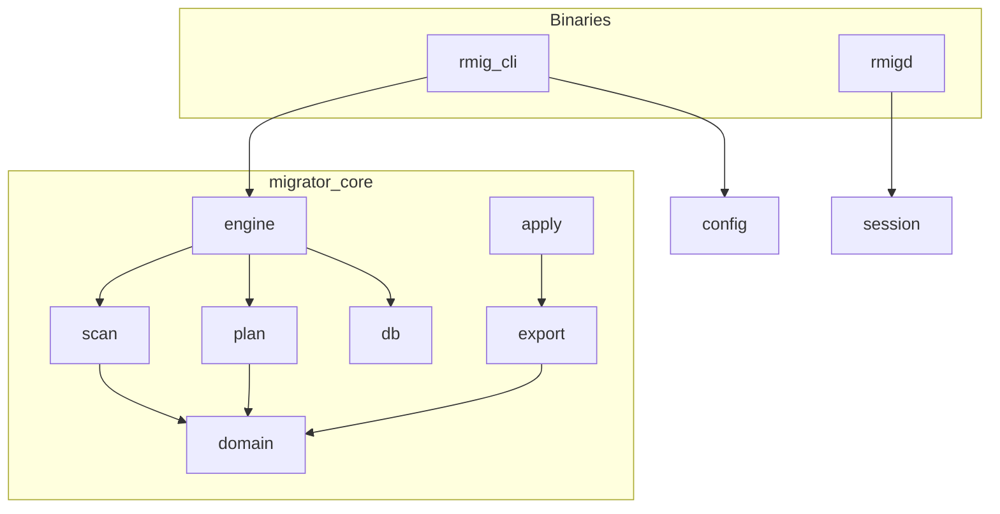
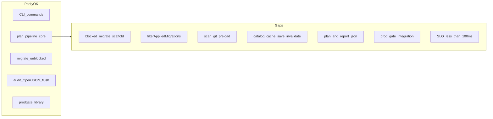

# Rust migrator implementation plan (<100ms `cli_wall_ms`)

Lifecycle: `Current`.

Canonical plan for the Rust port; do not rely on chat history.

## Purpose

Define the Rust migrator implementation plan, product SLO (`cli_wall_ms` < 100 ms), module map, Makefile targets, and remaining parity gaps vs the Go reference.

## Durable artifact

This file is the source of truth for the Rust migrator. Implementation lives under [`rust/`](../rust/).

## Status

**Snapshot:** 2026-05-19.

- **Implementation:** Milestones M0–M15 are implemented under [`rust/`](../rust/) (except optional SQL-only integration tests noted per milestone). Binaries: `rmig` ([`rust/crates/cli/`](../rust/crates/cli/)), `rmigd` ([`rust/crates/rmigd/`](../rust/crates/rmigd/)).
- **SLO:** **Met** via `make rust-slo` (release build, `rmigd` + `RMIG_SESSION`, parallel plan DB, warm catalog snapshot). Gate: [`integration_plan_sqlserver_suite`](../rust/crates/core/tests/integration_plan.rs) asserts `cli_wall_ms` &lt; `RMIG_SLO_MAX_CLI_WALL_MS` (default 100).
- **Production:** Rust `rmig` is the **operator-facing migrator** (Go was not deployed to production). Go remains for reference tests and Go↔Rust parity harness.
- **Parity vs Go reference:** Core `plan` / unblocked `migrate` match; remaining operator-facing gaps — see [Functional parity vs Go rmig](#functional-parity-vs-go-rmig) and [Remaining milestones](#remaining-milestones-m8).

## Scope

### In scope

- Side-by-side Rust implementation of Go `rmig` under [`rust/`](../rust/): commands `plan`, `migrate`, `validate`, `baseline`, `repair-checksum`, `version`
- Same operator contract: `RM_*` env, plan JSON wire format, `azdo_deploy_meta` audit tables, T-SQL in [`rust/sql/`](../rust/sql/)
- Product SLO: cache-miss `plan` **`cli_wall_ms` < 100 ms** (see [Product SLO](#product-slo-locked))
- Parity backlog M8–M15 until drop-in replacement is allowed
- Rust-only accelerators (documented separately): L1 cache, `rmigd` / `RMIG_SESSION`

### Out of scope

- Replacing Go reference code in the repository (Go stays for parity tests)
- `migrate` apply wall time SLO
- Empty-DB DROP/CREATE perf harness (excluded from plan SLO per Product SLO table)
- Windows integrated auth (`RM_DB_AUTH=integrated`)
- Footprint / struct-size / bench regression ([`internal/perf/`](../internal/perf/))
- Enforcing `RM_PLAN_FILE` / `RM_REPAIR_SCRIPT` (reserved in Go too; not engine-enforced)
- **M11** git scan preload and CI changed-path detectors ([`git/`](../rust/crates/core/src/git/), [`scan/git_preload.rs`](../rust/crates/core/src/scan/git_preload.rs))
- Running layout **checks** SQL scripts on `validate` (Go also does not; `validate` = plan pipeline only)
- WAN / remote SQL latency beyond co-located SQL (assume **≤5 ms** RTT to SQL)
- Makefile hygiene targets (`rust-fmt`, `rust-clippy`, `rust-loc`, aggregate `rust-check`) — maintainer tooling, not port product verification (see [Makefile targets](#makefile-targets))

## Product SLO (locked)

| Item | Definition |
|------|------------|
| **Metric** | Full CLI `plan`: **`cli_wall_ms`** (connect through diff + CLI overhead), emitted as JSON when `--json` |
| **Threshold** | **< 100 ms** |
| **Cold** | **Cache miss**: in-process and/or `azdo_deploy_meta.catalog_cache` miss, or layout digest change; **DB already has schema** (not empty DROP/CREATE) |
| **Warm** | Same threshold (no relaxation) |
| **Reference env** | Docker SQL Server 2019 + `.temp/sql` smoke tree; gate uses git delta per [`prod-gate.md`](prod-gate.md) |
| **Out of scope for SLO** | `migrate` apply wall, empty-DB DROP/CREATE harness, WAN RTT (assume **≤5 ms** to SQL or co-located SQL) |

### Feasibility note (Go baseline)

Go reference: [`internal/app/testdata/cli_phase/plan_full_cli_reference.json`](../internal/app/testdata/cli_phase/plan_full_cli_reference.json) — cold `cli_wall_ms` ≈ 635, warm ≈ 168.

Hitting **<100ms** requires mechanics beyond current Go: session reuse (`rmigd` / `RMIG_SESSION`), one plan DB round-trip (`plan_snapshot`), L1 cache (`.rmig/cache/`), scoped inspect on cache miss, and parallel ensure ‖ checksums+inspect (M13).

## Repository layout

```text
rust/
  Cargo.toml
  crates/cli/          # binary rmig
  crates/core/         # library migrator-core
  crates/rmigd/        # session daemon
  sql/                 # T-SQL only
  testdata/            # SLO + parity fixtures
```

## Architecture

- ≤100 LOC logic per file ([`scripts/check-rust-loc.sh`](../scripts/check-rust-loc.sh))
- Crate and layer boundaries ([`scripts/check-rust-arch.sh`](../scripts/check-rust-arch.sh)): no responsibility creep, no new megastructures without allowlist
- Single `Workspace` domain model; JSON wire types only in `export/`
- Hot-path layout: [`docs/data-oriented-layout-policy.md`](data-oriented-layout-policy.md) (Go `ObjectStore` is reference; Rust `Workspace` `HashMap` on diff is **DOD-X2** gap)
- External contract: same commands, `RM_*`, plan JSON, audit tables as Go

### Crate responsibilities

| Crate | Role | May use from `migrator-core` |
|-------|------|------------------------------|
| [`cli`](../rust/crates/cli/) | Parse flags, load env, call `engine::run_command`, write plan file | `config`, `engine`, `error`, `export` only |
| [`core`](../rust/crates/core/) | Scan, plan DB phase, diff, apply, audit, gate, session | internal modules per layer rules below |
| [`rmigd`](../rust/crates/rmigd/) | Hold warm TDS; JSON RPC | `session::run_daemon` only |



### Layer rules (`migrator-core`)

| Module | May import | Must not import |
|--------|------------|-----------------|
| `domain/` | `domain`, `error` | `driver`, `db`, `apply`, `engine`, `scan`, `plan`, `gate`, … |
| `export/` | `domain`, `error` | `driver`, `db`, `apply`, `engine`, `scan`, `plan`, … |
| `scan/` | `domain`, `error`, `timings` | `apply`, `db`, `driver`, `engine`, `plan`, `gate`, … |
| `engine/`, `db/`, `apply/`, … | orchestration layers as needed | — |

### Megastructures

- Default: **`pub` fields ≤ 12** per struct (enforced by `check-rust-arch.sh`).
- **Allowlist** (wire/domain aggregates; extend only with review): `Config`, `Workspace`, `ObjectEntry`, `Script`, `PlannedObject`, `MigrationPlan`, `PhaseTimings`, `PlanSnapshot`, `GateInput`.
- New types with more than 12 fields must be split or added to the allowlist in [`scripts/check-rust-arch.sh`](../scripts/check-rust-arch.sh).

### Clippy

- **Source of truth:** `cargo clippy --all-targets -- -D warnings` (Makefile: `rust-clippy`, part of maintainer `rust-check`).
- Covers `too_many_arguments`, `type_complexity`, and other `clippy::` lints — IDE and CI surface the same issues.
- **No** `#[allow(clippy::...)]` in `rust/crates/`; [`check-rust-arch.sh`](../scripts/check-rust-arch.sh) fails if any appear.
- Prefer small context structs (`DecideCtx`, `DiffCounters`) or type aliases (`L1Hit`) over suppressions.

## Milestones (M0–M7)

| ID | Implementation | Verified |
|----|----------------|----------|
| M0 | This doc, workspace, SQL copy, domain, LOC CI | `scripts/check-rust-loc.sh` |
| M1 | Driver + `PhaseTimings` / `cli_wall_ms` | unit tests; integration timings JSON |
| M2 | Scan → `Workspace` | scan/digest unit tests |
| M3 | Git delta scope, `catalog_cache` **load**, L1 cache | `delta_scope_test`; `integration_plan` (SLO **fails**) |
| M4 | Diff + export + `rmig plan` | `plan_diff_test` |
| M5 | Apply / migrate / lock / audit + `baseline` / `repair-checksum` CLI | apply path; scaffold/filter added in M8/M9 |
| M6 | Gate snapshot/compare library, golden baseline parse, `rust_cli_phase.sh` | `gate_snapshot_test`, `golden_snapshot_test`; **no** `test-prod-gate` equivalent |
| M7 | `rmigd` session daemon + `RMIG_SESSION` proxy | `session_protocol_test`; `make rust-rmigd` |

## Functional parity vs Go rmig

Operator-facing behavior comparison (not a code diff). Go reference: [`docs/solution.md`](solution.md), [`internal/engine/engine.go`](../internal/engine/engine.go).



| Area | Go | Rust | Gap |
|------|----|------|-----|
| Commands | `plan`, `migrate`, `validate`, `baseline`, `repair-checksum`, `version` | Same + **`rmigd`** (Rust-only) | `version` / buildinfo stub |
| Blocked migrate | Scaffold transition files, then `ExitPlanBlocked` (10) | [`scaffold/`](../rust/crates/core/src/scaffold/) + exit **10** on `migrate` | Go e2e **`blocked_table_plan`** (`make go-rust-e2e-all`) |
| Transitions apply | Skips already-applied via `LoadAllAppliedMigrations` | `migrate` filters via [`filter_migrations.rs`](../rust/crates/core/src/plan/filter_migrations.rs) + [`audit/migrations.rs`](../rust/crates/core/src/audit/migrations.rs) | Integration re-run test pending |
| Scan git fields | Preload `gitHash` / author / date when git enabled | Batched `git log` + per-file fallback after scan | OK |
| Git delta | CI env (GitHub/GitLab/Azure) + merge-base | Same ([`gate/changed_paths.rs`](../rust/crates/core/src/gate/changed_paths.rs), [`changed_paths_ci.rs`](../rust/crates/core/src/gate/changed_paths_ci.rs)) | OK |
| Catalog cache | Load + save + invalidate after audit flush | Load/save/invalidate ([`catalog_cache.rs`](../rust/crates/core/src/db/catalog_cache.rs), [`catalog_cache_save.rs`](../rust/crates/core/src/db/catalog_cache_save.rs)) | SQL integration test pending |
| Plan DB phase | Parallel `EnsureTables` ‖ checksums+inspect | Parallel on direct connect ([`plan_parallel.rs`](../rust/crates/core/src/db/plan_parallel.rs)); sequential with `RMIG_SESSION` | SLO still not met |
| Reports | `RM_REPORT_DIR` → `.plan.json`, `.report.json` | [`export/report.rs`](../rust/crates/core/src/export/report.rs) + `RM_REPORT_SYNC` | OK for all commands with plan |
| Exit codes | Typed (e.g. blocked=10, lock=7) | [`error::exit_code`](../rust/crates/core/src/error.rs) | OK for mapped variants |
| Prod gate | `make test-prod-gate` | `make rust-prod-gate` ([`prod_gate_integration.rs`](../rust/crates/core/tests/prod_gate_integration.rs)) | OK (same baseline JSON) |
| Golden plan JSON | Go `testdata` byte parity | `golden_baseline_test` + snapshot wire roundtrip | OK for prod gate snapshot shape |
| `RM_PLAN_FILE` / `RM_REPAIR_SCRIPT` | Loaded in config; engine does not enforce | Not read | Same as Go (reserved) |

**Parity OK today:** CLI command surface, core plan pipeline (scan → inspect → diff), unblocked migrate (schemas, objects, transitions), **blocked migrate scaffold** on `migrate`, audit history flush via OpenJSON, prod gate snapshot/compare as a library, transition scaffold **detection** at scan time.

## Remaining milestones (M8+)

Prioritized backlog for functional parity and SLO. Do not treat Rust as production-ready until M8–M15 are done.

| ID | Deliverable | Validates |
|----|-------------|-----------|
| **M8** | ~~Blocked migrate scaffold~~ **Done** | `scaffold_test`; Go e2e `blocked_table_plan` via `make go-rust-e2e-all` |
| **M9** | ~~`filterAppliedMigrations` + `LoadAllAppliedMigrations`~~ **Done** (unit test; SQL integration re-run pending) | `filter_migrations_test` |
| **M10** | ~~Catalog cache save + invalidate~~ **Done** | `RMIG_CATALOG_CACHE=1` SQL test pending |
| **M11** | ~~Git scan preload + CI changed-paths~~ **Done** | `git_preload_test`, `git_preload_nested_test`, `changed_paths_test` |
| **M12** | ~~Reports + exit code map~~ **Done** | `report_test`, `exit_code_test` |
| **M13** | ~~Parallel plan DB phase~~ **Done** (direct connect only) | `parallel_wall_ms` in timings; SLO gate still red |
| **M14** | ~~SLO gate~~ **Done** | `make rust-slo` (see `RMIG_USE_RMIGD`, `RMIG_INTEGRATION_WARM_SNAPSHOT`) |
| **M15** | ~~Prod gate integration + golden baseline~~ **Done** | `make rust-prod-gate`, `golden_baseline_test`, `prod_gate_integration` |

## Rust-only enhancements

Features beyond Go (not gaps):

- **L1 filesystem cache:** [`.rmig/cache/`](../rust/crates/core/src/cache/l1.rs) — in-process catalog/checksum cache keyed by server+database+layout digest.
- **Session daemon:** [`rmigd`](../rust/crates/rmigd/) + [`RMIG_SESSION`](../rust/crates/core/src/config/env.rs) — newline JSON RPC over Unix socket; warm TDS connection reused across CLI invocations.

## Verification

### Passing today

| Check | Command |
|-------|---------|
| Unit tests | `cd rust && cargo test -p migrator-core --test plan_diff_test --test gate_snapshot_test --test golden_snapshot_test --test golden_baseline_test --test prod_gate_integration --test delta_scope_test --test session_protocol_test --test filter_migrations_test --test plan_json_roundtrip_test --test scaffold_test --test report_test --test exit_code_test --test git_preload_test --test git_preload_nested_test --test changed_paths_test` |
| Footprint / DOD audit | `make rust-bench-footprint`, `make rust-bench-footprint-alloc`; [`docs/perf-footprint-audit.md`](perf-footprint-audit.md), [`docs/data-oriented-layout-policy.md`](data-oriented-layout-policy.md) |
| LOC ≤100/file | `scripts/check-rust-loc.sh` |
| Crate/layer/megastruct | `scripts/check-rust-arch.sh` or `make rust-arch` |
| Build | `make rust-build` or `cd rust && cargo build -p rmig -p rmigd` |
| Integration (SLO assertion may fail) | `make rust-test-int` |

### Not passing / missing

| Check | Status |
|-------|--------|
| `make rust-slo` | **Passing** (Docker SQL + `.temp/sql` + `rmigd` harness) |
| `make rust-prod-gate` | **Passing** (DROP/CREATE `rmig_test` by default; `RMIG_GATE_SKIP_DB_RESET=1` for warm DB) |
| Golden prod gate snapshot vs Go baseline | **Passing** (`golden_baseline_test`; full `.plan.json` export parity not required for gate) |

Clippy with `-D warnings`: `cd rust && cargo clippy -p migrator-core --all-targets -- -D warnings` (maintainer; not a product Makefile target).

### SLO gate (`make rust-slo`)

Starts Docker SQL (if needed), builds release `rmigd`, runs [`ops/perf/rust_cli_phase.sh`](../ops/perf/rust_cli_phase.sh) with:

| Env | Role |
|-----|------|
| `RMIG_USE_RMIGD=1` | Test harness spawns `rmigd`, sets `RMIG_SESSION` |
| `RMIG_INTEGRATION_WARM_SNAPSHOT=1` | Reuse warm plan DB snapshot after L1 invalidate (integration fixture) |
| `RMIG_SLO_MAX_CLI_WALL_MS=100` | Threshold |

Manual daemon (optional):

```bash
make rust-rmigd
RMIGD_SOCKET=/tmp/rmigd.sock RMIGD_ENV=.env ./rust/target/release/rmigd &
export RMIG_SESSION=/tmp/rmigd.sock
make rust-slo
```

### Makefile targets

Operator/product targets only (see [Scope](#scope) for boundaries):

| Target | Purpose |
|--------|---------|
| `make rust-slo` | cache-miss `cli_wall_ms` gate via [`ops/perf/rust_cli_phase.sh`](../ops/perf/rust_cli_phase.sh) |
| `make rust-rmigd` | build release `rmigd` |
| `make rust-test-int` | SQL Server integration (`integration_plan`) |
| `make rust-build` | release `rmig` binary |
| `make rust-arch` | crate boundaries, layer imports, megastructure field limits |
| `make rust-plan-db-perf` | plan DB `parallel_wall_ms` SLO workflow gate |
| `make rust-workflow-fast` | full workflow integration (~2 s) |

## System context

Production operators run Rust `rmig` / optional `rmigd`. Go binaries remain for parity regression only. Module boundaries are documented in `docs/specs/rust/README.md`.

## Interfaces and boundaries

- Inputs: `RM_*` env, SQL tree at `RM_SQL_ROOT`, SQL Server via TDS.
- Outputs: plan JSON, audit history, phase timings, exit codes.
- Boundaries: see per-module specs under `docs/specs/rust/`.

## Assumptions and constraints

- Assumptions: SQL Server 2016+ OPENJSON; co-located SQL for SLO measurement.
- Constraints: listed under [Scope — Out of scope](#scope).

## Nominal flow

1. Build Rust binaries (`make rust-build`, `make rust-rmigd`).
2. Run unit checks (`make rust-check`).
3. Run integration gates (`make rust-slo`, `make rust-prod-gate`, `make rust-workflow-fast`).

## Off-nominal behavior and failure containment

- Failure mode: SLO or prod gate regression.
  Containment: fix before promotion; compare phase JSON and trace artifacts in `ops/perf/artifacts/`.

## Operations and recovery

- Routine: `make rust-check` on every change touching `rust/crates/core/src/`.
- Recovery: revert commit or tune SQL/env; re-run failing Makefile target.

## Open issues and non-goals

- Open issues: remaining milestones M8–M15 in [Remaining milestones](#remaining-milestones-m8).
- Non-goals: this file is not the Go reference spec (`docs/specs/internals/README.md`).

## References

- Go engine: [`internal/engine/engine.go`](../internal/engine/engine.go)
- Go solution overview: [`docs/solution.md`](solution.md)
- Phase timings: [`internal/prodgate/gate.go`](../internal/prodgate/gate.go)
- Prod gate: [`docs/prod-gate.md`](prod-gate.md)
- Perf: [`ops/perf/README.md`](../ops/perf/README.md)
- Rust README: [`rust/README.md`](../rust/README.md)
