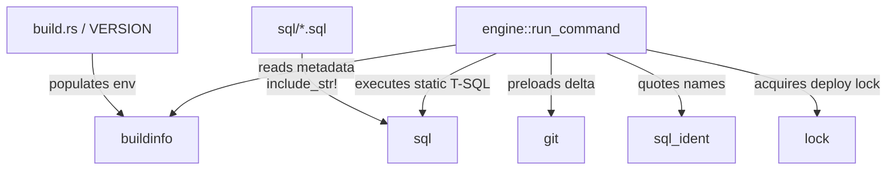

# Supporting modules (`git`, `lock`, `sql`, `sql_ident`, `buildinfo`)

Lifecycle: `Current`.

## Purpose

Describe the **supporting and auxiliary modules** that provide embedded SQL assets, git metadata extraction, distributed lock coordination, safe identifier quoting, and compile-time version serialization.

## Scope

This specification covers the five supporting modules inside `crates/core/src/`:

| Module | Canonical Path | System Role |
| :--- | :--- | :--- |
| **`git`** | `crates/core/src/git/` | Executes local git commands to resolve pull request diffs and changed paths. |
| **`lock`** | `crates/core/src/lock/mod.rs` | Implements distributed mutual exclusion via `sp_getapplock` (session-scoped advisory lock, resource `reporting_layer_migration`); no table is involved. |
| **`sql`** | `crates/core/src/sql/mod.rs` | Uses `include_str!` to embed T-SQL bootstrap and execution scripts into the binary. |
| **`sql_ident`** | `crates/core/src/sql_ident.rs` | Sanitizes path segments and safely quotes T-SQL bracket identifiers. |
| **`buildinfo`** | `crates/core/src/buildinfo/mod.rs` | Serializes compile-time version and git commit hash information. |

---

## System Context

The supporting modules act as a foundation for the primary plan-and-apply pipeline:



- **`buildinfo`** consumes compile-time environment variables (`RMIG_VERSION` and `RMIG_COMMIT`) injected by the Cargo build environment via `build.rs` to expose binary metadata.
- **`sql_ident`** is invoked dynamically in the scan and scaffold phases to scrub path inputs and securely format SQL object names prior to execution.
- **`sql`** provides the exact T-SQL queries executed during the plan database audit phase (bootstrapping metadata and reading catalog caches).

---

## Interfaces and Boundaries

### 1. `buildinfo` Interface
- **Inputs**: Read-only environment strings `RMIG_VERSION` and `RMIG_COMMIT` loaded during cargo compilation.
- **Outputs**:
  - `version() -> &'static str`: Returns the semver version string.
  - `commit() -> &'static str`: Returns the 7-character truncated git commit hash.
  - `write_json(writer: impl Write)`: Emits compact JSON (`{"version": "...", "commit": "...", "author": "..."}`) to the writer.

### 2. `sql_ident` Interface
- **`validate_path_component(name: &str) -> Result<()>`**: Validates that a string is a single-level directory or filename component. Rejects path traversal markers (`.`, `..`) and path separators (`/`, `\`, `\0`).
- **`validate_filename_token(token: &str) -> Result<()>`**: Rejects any character outside `A-Z`, `a-z`, `0-9`, `_`, and `-`. Primarily used for short-hash matching in scaffold directories.
- **`bracket_ident(name: &str) -> Result<String>`**: Wraps an identifier in `[name]` bracket formatting. Safely escapes any embedded closing bracket `]` by doubling it (`]]`).

---

## Assumptions and Constraints

- **T-SQL Quoting Constraint**: Bracket-based identifier quoting (`[identifier]`) is MSSQL-specific and matches Microsoft Transact-SQL standards.
- **Git Binary Constraint**: The `git` module assumes that a standard `git` executable is present in the host system's `PATH` when executing local delta preloads. If missing, it falls back to full inspection.
- **Static Asset Constraint**: The `sql` module assets are immutable post-compilation. Modifying a script under the root `sql/` directory requires a full cargo rebuild to take effect.

---

## Nominal Flow

### 1. Compile-Time Build Metadata Resolution
1. The compilation phase triggers `crates/core/build.rs`.
2. `build.rs` reads the root `VERSION` file and executes `git rev-parse --short HEAD`.
3. Variables are exposed as `RMIG_VERSION` and `RMIG_COMMIT`.
4. `buildinfo` binds these strings permanently using `option_env!`.

### 2. Identifier Sanitization & Execution
1. The CLI engine discovers a dynamic schema name from the local layout.
2. The engine calls `sql_ident::bracket_ident(schema_name)`.
3. If valid, the engine injects the quoted identifier securely into the execution SQL fragment.

---

## Off-Nominal Behavior and Failure Containment

### 1. SQL Injection / Directory Traversal Payload
- **Condition**: An input folder or database schema name contains path traversal payloads (`../private.key`) or bracket injects (`a] DROP DATABASE`).
- **Containment**: `validate_path_component` and `bracket_ident` capture the invalid segments instantly, aborting execution and returning `Error::InvalidInput`. The query is never executed against the TDS driver.

### 2. Offline / Gitless Build Environments
- **Condition**: Compilation occurs outside a git repository or without active environment variables.
- **Containment**: `buildinfo` captures the `None` compile state and falls back safely to version `0.0.0-dev` and commit hash `unknown`.

---

## Verification and Validation

### 1. Automated Unit Tests
- Execute `cargo test -p migrator-core --lib sql_ident` to verify bracket escaping and traversal rejection:
  ```rust
  assert_eq!(bracket_ident("table]name").unwrap(), "[table]]name]");
  assert!(validate_path_component("..").is_err());
  ```
- Execute `cargo test -p migrator-core --lib buildinfo` to verify compile metadata round-tripping.

### 2. Dynamic Integration Checks
- Verify CLI version output formats:
  ```bash
  ./bin/rmig --version
  ./bin/rmig version --json
  ```

---

## Operations and Recovery

### 1. Lock Cleanup
- In the event of a crash during a locked migrate run, the distributed lock might remain active.
- **Recovery**: Operators can run the recovery SQL embedded in `sql/lock/release.sql` from an external SQL terminal. In practice this is rarely needed: the lock is session-scoped (`@LockOwner = 'Session'`), so it auto-releases when the crashed connection closes. (`repair-checksum` repairs audit checksums only and does not touch locks.)

### 2. Re-compiling Static Assets
- Modifying T-SQL code inside `sql/` does not require database migration; it only requires running:
  ```bash
  make build
  ```
  to re-embed the code asset.

---

## Open Issues and Non-Goals

- **Non-Goals**:
  - `sql_ident` does not validate T-SQL syntax or parse the SQL AST; it only formats individual identifier strings.
  - The `sql` module does not query local file systems at runtime; it only provides in-memory statically linked strings.

---

## References

- Rustdoc Module API: [`crates/core/src/sql_ident.rs`](../../../crates/core/src/sql_ident.rs)
- Rustdoc Module API: [`crates/core/src/buildinfo/mod.rs`](../../../crates/core/src/buildinfo/mod.rs)
- Core specs directory index: [README.md](README.md)
